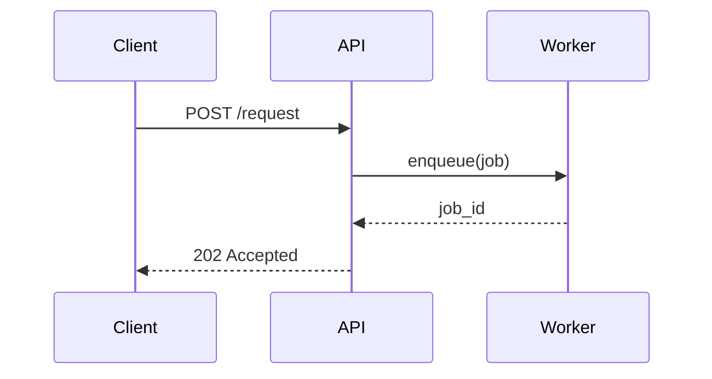

# markdown-to-confluence

Takes markdown files with mermaid diagrams and converts them to Confluence pages, rendering each mermaid block as an attached PNG image.

## Features

- **Markdown → Confluence storage format** – headings, bold/italic, lists, tables, code blocks, links, images
- **Mermaid diagrams → PNG images** – uses the local `mmdc` CLI; falls back to [mermaid.ink](https://mermaid.ink) URLs
- **Multiple files with sections** – combine several markdown files into a single Confluence page using expandable sections (`--sections`)
- **Kiro `@publish-design` prompt** – see [.kiro/prompts/publish-design.md](.kiro/prompts/publish-design.md) for an AI-guided publishing workflow
- **Dry-run mode** – preview the generated Confluence XML without publishing

## Installation

```bash
pip install -e .
# Optional: local mermaid CLI for offline image generation
npm install -g @mermaid-js/mermaid-cli
```

## Configuration

Set the following environment variables (or place them in a `.env` file):

```bash
CONFLUENCE_URL=https://<your-org>.atlassian.net/wiki
CONFLUENCE_USERNAME=you@example.com
CONFLUENCE_API_TOKEN=<your-api-token>
CONFLUENCE_SPACE_KEY=<space-key>
CONFLUENCE_PARENT_ID=<optional-parent-page-id>
```

Generate an API token at <https://id.atlassian.com/manage/api-tokens>.

## Usage

### Publish a single file

```bash
markdown-to-confluence path/to/design.md
```

### Publish multiple files as separate child pages

```bash
markdown-to-confluence docs/overview.md docs/api.md docs/data-model.md
```

### Combine multiple files into one page with expandable sections

```bash
markdown-to-confluence --sections \
  docs/overview.md docs/api.md docs/data-model.md \
  --title "Architecture Overview"
```

### Preview without publishing (dry run)

```bash
markdown-to-confluence --dry-run path/to/design.md
```

### Skip local mermaid CLI (use online rendering)

```bash
markdown-to-confluence --no-local-mermaid path/to/design.md
```

## Mermaid diagram example

A mermaid code block in your markdown:

````markdown
# Service Architecture


````

…becomes a Confluence image attachment (PNG) on the published page.

## Kiro @publish-design prompt

When using [Kiro](https://kiro.dev), invoke `@publish-design` to get step-by-step guidance for publishing your design documentation to Confluence. The prompt is located at [.kiro/prompts/publish-design.md](.kiro/prompts/publish-design.md).

## Development

```bash
pip install -e ".[dev]"
pytest
```

